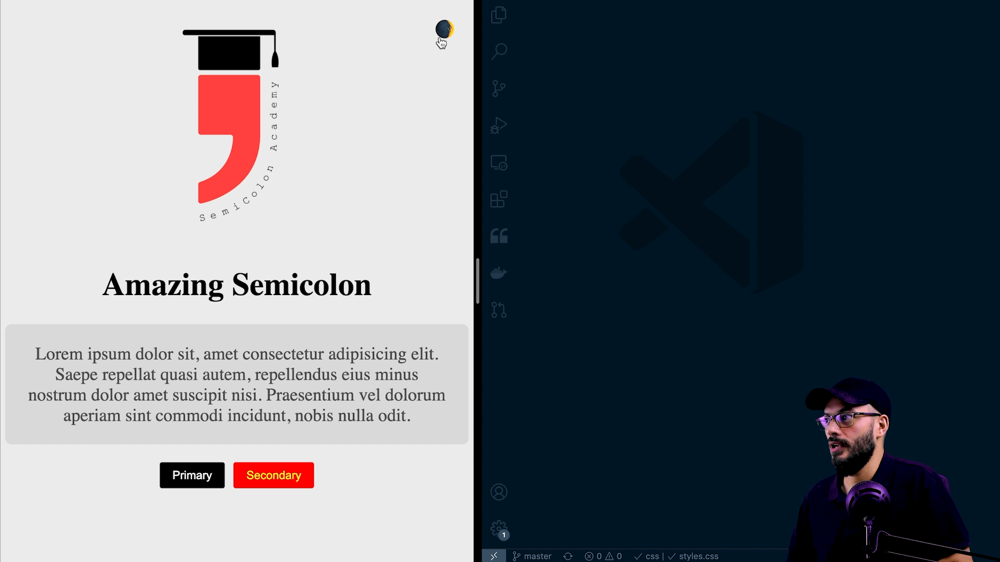

# 004 Auto dark mode

In this challenge we need to implement a dark mode in 3 different ways:

## Challenging list

- Enable Dark mode automatically using only CSS
- Implement the dark mode toggle button usign JavaScript
- Listen to the user preference alongside with the toggle button

## More explanations

- if you understand Arabic here is a link for a [youtube video](https://youtu.be/QC0PMPhq6CM) explaining the steps I took to implement that challenge,

## 💻 Happy coding and know on twitter if you need any help in doing that challenge ([@med7atdawoud](http://twitter.com/med7atdawoud)) or just say Hi 👋
